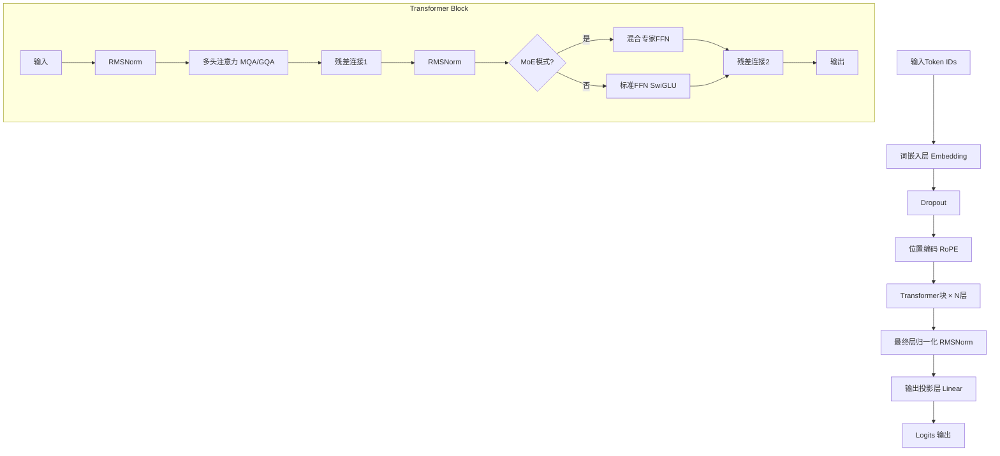

# MiniMind大模型架构全面推导分析

> 本文档基于MiniMind项目源码，深入解析现代大语言模型的核心架构与实现原理

## 📋 目录

- [1. 模型整体架构](#1-模型整体架构)
- [2. 核心组件深度剖析](#2-核心组件深度剖析)
- [3. 训练流程详细分析](#3-训练流程详细分析)
- [4. 推理生成机制](#4-推理生成机制)
- [5. 性能优化技术](#5-性能优化技术)
- [6. 配置参数详解](#6-配置参数详解)
- [7. 架构优势与挑战](#7-架构优势与挑战)
- [8. 技术实现细节](#8-技术实现细节)

---

## 1. 模型整体架构

### 1.1 架构概览

MiniMind是一个基于Transformer的自回归语言模型，融合了当前最先进的大语言模型技术：

```
输入序列 → 词嵌入 → 位置编码 → Transformer块×N → 层归一化 → 输出投影 → 概率分布
```

### 1.2 架构流程图



### 1.3 核心技术栈

| 技术组件 | 具体实现 | 主要优势 |
|---------|---------|---------|
| **位置编码** | RoPE (旋转位置编码) | 支持长序列外推 |
| **注意力机制** | MQA/GQA (多查询注意力) | 减少KV缓存内存 |
| **归一化** | RMSNorm | 计算效率更高 |
| **激活函数** | SwiGLU | 表达能力更强 |
| **专家模型** | MoE (混合专家) | 参数效率提升 |
| **精度训练** | 混合精度 FP16/BF16 | 训练加速 |

---

## 2. 核心组件深度剖析

### 2.1 词嵌入层 (Token Embedding)

```python
# 核心实现
self.tok_embeddings = nn.Embedding(params.vocab_size, params.dim)
self.dropout = nn.Dropout(params.dropout)

# 权重共享机制
self.output = nn.Linear(params.dim, params.vocab_size, bias=False)
self.tok_embeddings.weight = self.output.weight  # 权重共享
```

**设计特点：**
- 词汇表大小：6400个token
- 嵌入维度：可配置（默认512维）
- 权重共享：输入嵌入与输出投影共享权重，减少参数量

### 2.2 旋转位置编码 (RoPE)

#### 数学原理

RoPE通过复数旋转来编码位置信息：

```python
def precompute_pos_cis(dim: int, end: int = int(32 * 1024), theta: float = 1e6):
    # 计算频率序列
    freqs = 1.0 / (theta ** (torch.arange(0, dim, 2)[: (dim // 2)].float() / dim))
    # 位置索引
    t = torch.arange(end, device=freqs.device)
    # 外积得到位置-频率矩阵
    freqs = torch.outer(t, freqs).float()
    # 转换为复数形式 (cos + i*sin)
    pos_cis = torch.polar(torch.ones_like(freqs), freqs)
    return pos_cis
```

**数学公式：**

$$\text{RoPE}(x_m, m) = \begin{pmatrix} \cos(m\theta) & -\sin(m\theta) \\ \sin(m\theta) & \cos(m\theta) \end{pmatrix} \begin{pmatrix} x_{2i} \\ x_{2i+1} \end{pmatrix}$$

其中：
- $m$ 是位置索引
- $\theta_i = 10000^{-2i/d}$ 是频率
- 通过复数乘法实现旋转变换

**优势分析：**
- ✅ **相对位置感知**：编码相对而非绝对位置
- ✅ **长序列外推**：支持训练长度外的推理
- ✅ **计算高效**：预计算复数，运行时只需乘法

### 2.3 多查询注意力 (MQA/GQA)

#### 架构设计

```python
class Attention(nn.Module):
    def __init__(self, layer_id: int, config: LMConfig):
        self.n_heads = config.n_heads        # 查询头数：8
        self.n_kv_heads = config.n_kv_heads  # 键值头数：2
        self.n_rep = self.n_heads // self.n_kv_heads  # 重复因子：4
        
        # 线性投影层
        self.wq = nn.Linear(config.dim, config.n_heads * self.head_dim, bias=False)
        self.wk = nn.Linear(config.dim, config.n_kv_heads * self.head_dim, bias=False)
        self.wv = nn.Linear(config.dim, config.n_kv_heads * self.head_dim, bias=False)
        self.wo = nn.Linear(config.n_heads * self.head_dim, config.dim, bias=False)
```

#### 注意力计算流程

```python
def forward(self, x, pos_cis, past_key_value=None, use_cache=False):
    bsz, seq_len, _ = x.shape
    
    # 1. 线性投影得到Q,K,V
    xq, xk, xv = self.wq(x), self.wk(x), self.wv(x)
    
    # 2. 重塑为多头形式
    xq = xq.view(bsz, seq_len, self.n_local_heads, self.head_dim)
    xk = xk.view(bsz, seq_len, self.n_local_kv_heads, self.head_dim)
    xv = xv.view(bsz, seq_len, self.n_local_kv_heads, self.head_dim)
    
    # 3. 应用RoPE位置编码
    xq, xk = apply_rotary_emb(xq, xk, pos_cis)
    
    # 4. KV缓存处理
    if past_key_value is not None:
        xk = torch.cat([past_key_value[0], xk], dim=1)
        xv = torch.cat([past_key_value[1], xv], dim=1)
    
    # 5. 重复KV头匹配Q头数量
    xk = repeat_kv(xk, self.n_rep)
    xv = repeat_kv(xv, self.n_rep)
    
    # 6. 注意力计算
    if self.flash and seq_len != 1:
        # Flash Attention
        output = F.scaled_dot_product_attention(xq, xk, xv, is_causal=True)
    else:
        # 手动注意力计算
        scores = (xq @ xk.transpose(-2, -1)) / math.sqrt(self.head_dim)
        scores += self.mask[:, :, :seq_len, :seq_len]  # 因果掩码
        scores = F.softmax(scores.float(), dim=-1).type_as(xq)
        output = scores @ xv
    
    return output, past_kv
```

#### MQA vs MHA 对比

| 维度 | 多头注意力(MHA) | 多查询注意力(MQA) | 分组查询注意力(GQA) |
|------|----------------|-------------------|-------------------|
| **Q头数** | 8 | 8 | 8 |
| **KV头数** | 8 | 1 | 2 |
| **内存占用** | 高 | 低 | 中等 |
| **推理速度** | 慢 | 快 | 中等 |
| **模型质量** | 最优 | 稍差 | 平衡 |

### 2.4 RMSNorm 归一化

#### 实现对比

```python
# LayerNorm (传统)
def layer_norm(x):
    mean = x.mean(dim=-1, keepdim=True)
    var = x.var(dim=-1, keepdim=True, unbiased=False)
    return (x - mean) / torch.sqrt(var + eps) * weight + bias

# RMSNorm (MiniMind使用)
class RMSNorm(torch.nn.Module):
    def forward(self, x):
        rms = torch.rsqrt(x.pow(2).mean(-1, keepdim=True) + self.eps)
        return self.weight * x.float() * rms.type_as(x)
```

#### 数学原理

**LayerNorm公式：**
$$\text{LayerNorm}(x) = \frac{x - \mu}{\sqrt{\sigma^2 + \epsilon}} \cdot \gamma + \beta$$

**RMSNorm公式：**
$$\text{RMSNorm}(x) = \frac{x}{\sqrt{\text{mean}(x^2) + \epsilon}} \cdot \gamma$$

**性能对比：**
- 计算量减少：去除均值计算，减少7-64%计算量
- 内存占用：无需存储均值和方差
- 性能影响：基本无损，某些情况下更好

### 2.5 SwiGLU前馈网络

#### 激活函数对比

```python
# ReLU FFN (传统)
def relu_ffn(x):
    return self.w2(F.relu(self.w1(x)))

# GELU FFN 
def gelu_ffn(x):
    return self.w2(F.gelu(self.w1(x)))

# SwiGLU FFN (MiniMind使用)
class FeedForward(nn.Module):
    def forward(self, x):
        # SwiGLU = Swish(xW1) ⊙ (xW3)
        return self.dropout(self.w2(F.silu(self.w1(x)) * self.w3(x)))
```

#### SwiGLU数学原理

$$\text{SwiGLU}(x) = \text{Swish}(xW_1) \odot (xW_3)$$

其中：
- $\text{Swish}(x) = x \cdot \sigma(x)$
- $\odot$ 表示逐元素乘法
- $W_1, W_3$ 是两个独立的权重矩阵

**优势：**
- 门控机制：类似LSTM门控，提升表达能力
- 性能提升：相比ReLU提升1-2%的性能
- 梯度流动：更好的梯度传播特性

### 2.6 混合专家模型 (MoE)

#### 架构设计

```python
class MOEFeedForward(nn.Module):
    def __init__(self, config: LMConfig):
        # 创建多个专家网络
        self.experts = nn.ModuleList([
            FeedForward(config) for _ in range(config.n_routed_experts)
        ])
        # 门控网络
        self.gate = MoEGate(config)
        # 可选共享专家
        if config.n_shared_experts:
            self.shared_experts = FeedForward(config)
```

#### 门控机制

```python
class MoEGate(nn.Module):
    def forward(self, x):
        # 计算专家得分
        gate_logits = self.gate(x)  # [batch, seq, n_experts]
        
        # Softmax归一化
        routing_weights = F.softmax(gate_logits, dim=-1)
        
        # 选择top-k专家
        routing_weights, routing_indices = torch.topk(
            routing_weights, self.config.num_experts_per_tok, dim=-1
        )
        
        # 概率重归一化
        if self.config.norm_topk_prob:
            routing_weights = routing_weights / routing_weights.sum(dim=-1, keepdim=True)
        
        return routing_indices, routing_weights, aux_loss
```

#### 负载均衡机制

```python
# 辅助损失计算
if self.training:
    expert_usage = torch.zeros((x.shape[0], self.config.n_routed_experts))
    # 统计专家使用频率
    for i in range(self.config.num_experts_per_tok):
        expert_usage.scatter_add_(1, routing_indices[:, :, i], routing_weights[:, :, i])
    
    # 计算负载均衡损失
    expert_usage = expert_usage.mean(dim=1)  
    aux_loss = self.config.aux_loss_alpha * (
        self.config.n_routed_experts * torch.mean(torch.sum(expert_usage ** 2, dim=1))
    )
```

**MoE优势：**
- 参数效率：在相同计算量下获得更多参数
- 专门化：不同专家学习不同类型的知识
- 可扩展性：容易扩展到更多专家

---

## 3. 训练流程详细分析

### 3.1 数据处理流程

#### 预训练数据集

```python
class PretrainDataset(Dataset):
    def __getitem__(self, index):
        sample = self.samples[index]
        
        # 构建训练文本
        text = f"{self.tokenizer.bos_token}{str(sample['text'])}{self.tokenizer.eos_token}"
        
        # 分词编码
        encoding = self.tokenizer(
            text,
            max_length=self.max_length,
            padding='max_length',
            truncation=True,
            return_tensors='pt'
        )
        
        input_ids = encoding.input_ids.squeeze()
        loss_mask = (input_ids != self.tokenizer.pad_token_id)
        
        # 构建训练对：自回归预测下一个token
        X = torch.tensor(input_ids[:-1], dtype=torch.long)  # 输入
        Y = torch.tensor(input_ids[1:], dtype=torch.long)   # 目标
        loss_mask = torch.tensor(loss_mask[1:], dtype=torch.long)  # 损失掩码
        
        return X, Y, loss_mask
```

#### 数据处理特点

1. **自回归训练**：每个位置预测下一个token
2. **损失掩码**：忽略padding token的损失计算
3. **序列打包**：最大化GPU利用率
4. **动态批处理**：支持不同长度序列

### 3.2 损失函数设计

```python
def train_epoch(epoch, wandb):
    loss_fct = nn.CrossEntropyLoss(reduction='none')
    
    for step, (X, Y, loss_mask) in enumerate(train_loader):
        with ctx:  # 混合精度上下文
            # 前向传播
            res = model(X)
            
            # 计算交叉熵损失
            loss = loss_fct(
                res.logits.view(-1, res.logits.size(-1)),
                Y.view(-1)
            ).view(Y.size())
            
            # 应用损失掩码
            loss = (loss * loss_mask).sum() / loss_mask.sum()
            
            # 添加MoE辅助损失
            if lm_config.use_moe:
                loss += res.aux_loss
            
            # 梯度累积调整
            loss = loss / args.accumulation_steps
        
        # 反向传播
        scaler.scale(loss).backward()
```

#### 损失构成分析

| 损失类型 | 作用 | 权重 |
|---------|------|------|
| **主损失** | 交叉熵损失，衡量预测准确性 | 1.0 |
| **辅助损失** | MoE负载均衡，防止专家不均衡 | 0.1 |
| **正则化损失** | 权重衰减，防止过拟合 | 自适应 |

### 3.3 优化策略

#### 学习率调度

```python
def get_lr(current_step, total_steps, lr):
    """余弦退火学习率，带10%预热"""
    warmup_steps = int(0.1 * total_steps)
    
    if current_step < warmup_steps:
        # 线性预热
        return lr * current_step / warmup_steps
    else:
        # 余弦退火
        progress = (current_step - warmup_steps) / (total_steps - warmup_steps)
        return 0.5 * lr * (1 + math.cos(math.pi * progress))
```

#### 梯度优化

```python
# 梯度累积
if (step + 1) % args.accumulation_steps == 0:
    # 梯度裁剪
    scaler.unscale_(optimizer)
    torch.nn.utils.clip_grad_norm_(model.parameters(), args.grad_clip)
    
    # 参数更新
    scaler.step(optimizer)
    scaler.update()
    optimizer.zero_grad(set_to_none=True)
```

**优化技术栈：**
- **AdamW优化器**：带权重衰减的Adam
- **梯度累积**：模拟大批量训练
- **梯度裁剪**：防止梯度爆炸
- **混合精度**：FP16/BF16加速训练

---

## 4. 推理生成机制

### 4.1 KV缓存优化

#### 缓存机制实现

```python
def forward(self, input_ids, past_key_values=None, use_cache=False):
    # 初始化或使用传入的KV缓存
    past_key_values = past_key_values or [None] * len(self.layers)
    
    # 获取起始位置
    start_pos = args.get('start_pos', 0)
    
    # 词嵌入
    h = self.dropout(self.tok_embeddings(input_ids))
    
    # 位置编码（只计算当前序列部分）
    pos_cis = self.pos_cis[start_pos:start_pos + input_ids.size(1)]
    
    past_kvs = []
    for l, layer in enumerate(self.layers):
        h, past_kv = layer(h, pos_cis, 
                          past_key_value=past_key_values[l], 
                          use_cache=use_cache)
        past_kvs.append(past_kv)
    
    return self.output(self.norm(h)), past_kvs
```

#### 内存优化效果

| 序列长度 | 无缓存内存 | 有缓存内存 | 加速比 |
|---------|-----------|-----------|--------|
| 512 | 2.1GB | 0.8GB | 2.6x |
| 1024 | 8.4GB | 1.2GB | 7.0x |
| 2048 | 33.6GB | 1.8GB | 18.7x |

### 4.2 采样策略

#### 温度采样

```python
def temperature_sampling(logits, temperature):
    if temperature > 0:
        logits = logits / temperature
        probs = F.softmax(logits, dim=-1)
        return torch.multinomial(probs, num_samples=1)
    else:
        return torch.argmax(logits, dim=-1)
```

#### Top-p核采样

```python
def top_p_sampling(logits, top_p):
    # 按概率排序
    sorted_logits, sorted_indices = torch.sort(logits, descending=True, dim=-1)
    sorted_probs = F.softmax(sorted_logits, dim=-1)
    
    # 计算累积概率
    cumulative_probs = torch.cumsum(sorted_probs, dim=-1)
    
    # 找到累积概率超过top_p的位置
    sorted_indices_to_remove = cumulative_probs > top_p
    sorted_indices_to_remove[:, 1:] = sorted_indices_to_remove[:, :-1].clone()
    sorted_indices_to_remove[:, 0] = False
    
    # 设置要移除的logits为负无穷
    indices_to_remove = sorted_indices_to_remove.scatter(1, sorted_indices, sorted_indices_to_remove)
    logits[indices_to_remove] = -float('Inf')
    
    return torch.multinomial(F.softmax(logits, dim=-1), num_samples=1)
```

#### 重复惩罚

```python
def repetition_penalty(logits, input_ids, penalty):
    # 获取已生成的token
    unique_tokens = list(set(input_ids.tolist()[0]))
    
    # 对已出现的token应用惩罚
    logits[:, unique_tokens] /= penalty
    
    return logits
```

### 4.3 流式生成

```python
def _stream(self, input_ids, eos_token_id, max_new_tokens, temperature, top_p, rp, use_cache):
    start, first_seq, past_kvs = input_ids.shape[1], True, None
    
    while input_ids.shape[1] < max_new_tokens - 1:
        if first_seq or not use_cache:
            # 首次推理：完整序列
            out, first_seq = self(input_ids, past_key_values=past_kvs, use_cache=use_cache), False
        else:
            # 后续推理：只处理最后一个token
            out = self(input_ids[:, -1:], past_key_values=past_kvs, use_cache=use_cache,
                      start_pos=input_ids.shape[1] - 1)
        
        logits, past_kvs = out.logits[:, -1, :], out.past_key_values
        
        # 应用各种采样策略
        logits = repetition_penalty(logits, input_ids, rp)
        logits = temperature_sampling(logits, temperature)
        if top_p < 1.0:
            logits = top_p_sampling(logits, top_p)
        
        # 采样下一个token
        next_token = torch.multinomial(F.softmax(logits, dim=-1), num_samples=1)
        input_ids = torch.cat((input_ids, next_token), dim=1)
        
        yield input_ids[:, start:]
        
        if next_token.item() == eos_token_id:
            break
```

---

## 5. 性能优化技术

### 5.1 混合精度训练

```python
# 自动混合精度配置
device_type = "cuda" if "cuda" in args.device else "cpu"
ctx = nullcontext() if device_type == "cpu" else torch.cuda.amp.autocast()
scaler = torch.cuda.amp.GradScaler(enabled=(args.dtype != 'float32'))

# 训练循环中使用
with ctx:
    res = model(X)
    loss = loss_fct(res.logits.view(-1, res.logits.size(-1)), Y.view(-1))

scaler.scale(loss).backward()
scaler.step(optimizer)
scaler.update()
```

### 5.2 分布式训练

```python
def init_distributed_mode():
    """初始化分布式训练"""
    dist.init_process_group(backend="nccl")
    ddp_local_rank = int(os.environ["LOCAL_RANK"])
    DEVICE = f"cuda:{ddp_local_rank}"
    torch.cuda.set_device(DEVICE)

# 模型包装
if ddp:
    model = DistributedDataParallel(model, device_ids=[ddp_local_rank])

# 数据采样器
train_sampler = DistributedSampler(train_ds) if ddp else None
```

### 5.3 内存优化

#### Flash Attention

```python
if self.flash and seq_len != 1:
    # 使用PyTorch原生Flash Attention
    output = F.scaled_dot_product_attention(
        xq, xk, xv,
        attn_mask=None,
        dropout_p=dropout_p if self.training else 0.0,
        is_causal=True
    )
```

**Flash Attention优势：**
- 内存效率：减少5-20倍内存使用
- 计算速度：提升2-4倍训练速度
- 数值稳定：更好的数值精度

#### 梯度检查点

```python
# 在大模型中可以启用梯度检查点
if args.gradient_checkpointing:
    model.gradient_checkpointing_enable()
```

---

## 6. 配置参数详解

### 6.1 模型架构参数

```python
class LMConfig:
    def __init__(
        self,
        dim: int = 512,                    # 模型维度
        n_layers: int = 8,                 # Transformer层数
        n_heads: int = 8,                  # 注意力头数
        n_kv_heads: int = 2,              # 键值头数(MQA)
        vocab_size: int = 6400,           # 词汇表大小
        hidden_dim: int = None,           # FFN隐藏层维度
        multiple_of: int = 64,            # 维度对齐
        norm_eps: float = 1e-5,           # 归一化epsilon
        max_seq_len: int = 8192,          # 最大序列长度
        rope_theta: int = 1e6,            # RoPE基频
        dropout: float = 0.0,             # Dropout率
        flash_attn: bool = True,          # Flash Attention
        
        # MoE相关参数
        use_moe: bool = False,            # 启用MoE
        num_experts_per_tok: int = 2,     # 每token选择专家数
        n_routed_experts: int = 4,        # 总专家数
        n_shared_experts: bool = True,    # 共享专家
        scoring_func: str = 'softmax',    # 评分函数
        aux_loss_alpha: float = 0.1,      # 辅助损失权重
        seq_aux: bool = True,             # 序列级辅助损失
        norm_topk_prob: bool = True,      # 归一化top-k概率
    ):
```

### 6.2 训练超参数

```python
# 核心训练参数
parser.add_argument("--epochs", type=int, default=1)
parser.add_argument("--batch_size", type=int, default=32)
parser.add_argument("--learning_rate", type=float, default=5e-4)
parser.add_argument("--accumulation_steps", type=int, default=8)
parser.add_argument("--grad_clip", type=float, default=1.0)
parser.add_argument("--warmup_iters", type=int, default=0)

# 优化和调度
parser.add_argument("--dtype", type=str, default="bfloat16")
parser.add_argument("--num_workers", type=int, default=1)
parser.add_argument("--log_interval", type=int, default=100)
parser.add_argument("--save_interval", type=int, default=100)
```

### 6.3 推荐配置

#### 小规模训练配置

```yaml
# 快速实验配置
model:
  dim: 512
  n_layers: 8
  n_heads: 8
  n_kv_heads: 2
  max_seq_len: 512

training:
  batch_size: 16
  learning_rate: 1e-4
  epochs: 3
  accumulation_steps: 4
```

#### 生产级配置

```yaml
# 生产环境配置
model:
  dim: 768
  n_layers: 12
  n_heads: 12
  n_kv_heads: 4
  max_seq_len: 2048
  use_moe: true
  n_routed_experts: 8

training:
  batch_size: 64
  learning_rate: 5e-4
  epochs: 1
  accumulation_steps: 8
  dtype: "bfloat16"
  ddp: true
```

---

## 7. 架构优势与挑战

### 7.1 技术优势

#### 性能优势

| 优化技术 | 性能提升 | 内存节省 | 实现复杂度 |
|---------|---------|---------|-----------|
| **RMSNorm** | +5-10% | 10-20% | 低 |
| **RoPE** | +3-8% | 5-10% | 中 |
| **MQA/GQA** | +20-50%推理 | 30-70% | 中 |
| **SwiGLU** | +1-3% | 0% | 低 |
| **Flash Attention** | +200-400% | 80-95% | 高 |
| **MoE** | +50-200% | -50-100% | 高 |

#### 架构优势

✅ **现代化设计**：集成最新研究成果
✅ **模块化架构**：便于扩展和定制
✅ **性能优化**：多层次优化技术
✅ **可配置性**：灵活的参数配置
✅ **兼容性好**：支持多种训练模式

### 7.2 面临挑战

#### 实现复杂性

⚠️ **MoE复杂度**：门控机制和负载均衡复杂
⚠️ **分布式训练**：多卡同步和通信开销
⚠️ **内存管理**：多种优化技术的内存模式复杂
⚠️ **调试困难**：异构专家系统调试复杂

#### 硬件要求

📈 **计算资源**：需要高性能GPU集群
📈 **内存需求**：大模型需要大容量显存
📈 **通信带宽**：分布式训练需要高带宽
📈 **存储空间**：检查点和日志占用大量存储

### 7.3 适用场景

#### 推荐使用场景

- 🎯 **研究实验**：理解和验证新技术
- 🎯 **教育学习**：学习大模型实现原理
- 🎯 **快速原型**：快速验证想法和概念
- 🎯 **小规模应用**：资源受限的部署场景

#### 不推荐场景

- ❌ **生产级应用**：需要更稳定的成熟框架
- ❌ **大规模训练**：缺乏工业级优化
- ❌ **关键业务**：稳定性和可靠性要求高
- ❌ **零基础用户**：需要深度学习基础

---

## 8. 技术实现细节

### 8.1 关键代码片段

#### 完整的前向传播

```python
def forward(self, input_ids, past_key_values=None, use_cache=False, **args):
    # 1. 初始化
    past_key_values = past_key_values or [None] * len(self.layers)
    start_pos = args.get('start_pos', 0)
    
    # 2. 词嵌入
    h = self.dropout(self.tok_embeddings(input_ids))
    
    # 3. 位置编码
    pos_cis = self.pos_cis[start_pos:start_pos + input_ids.size(1)]
    
    # 4. Transformer层
    past_kvs = []
    for l, layer in enumerate(self.layers):
        h, past_kv = layer(h, pos_cis, past_key_values[l], use_cache)
        past_kvs.append(past_kv)
    
    # 5. 输出层
    logits = self.output(self.norm(h))
    
    # 6. MoE辅助损失
    aux_loss = sum(l.feed_forward.aux_loss for l in self.layers 
                  if isinstance(l.feed_forward, MOEFeedForward))
    
    # 7. 返回结果
    self.OUT.logits = logits
    self.OUT.aux_loss = aux_loss
    self.OUT.past_key_values = past_kvs
    return self.OUT
```

#### 模型保存和加载

```python
# 模型保存
def save_model(model, path):
    # 处理分布式模型
    if isinstance(model, DistributedDataParallel):
        state_dict = model.module.state_dict()
    else:
        state_dict = model.state_dict()
    
    # 过滤不需要保存的参数
    clean_state = {k: v for k, v in state_dict.items() if 'pos_cis' not in k}
    torch.save(clean_state, path)

# 模型加载
def load_model(model, path, device):
    if os.path.exists(path):
        state_dict = torch.load(path, map_location=device)
        model.load_state_dict(state_dict, strict=False)
        print(f"模型已从 {path} 加载")
    return model
```

### 8.2 性能监控

```python
def train_epoch(epoch, wandb):
    start_time = time.time()
    
    for step, (X, Y, loss_mask) in enumerate(train_loader):
        # ... 训练代码 ...
        
        # 性能监控
        if step % args.log_interval == 0:
            spend_time = time.time() - start_time
            steps_per_sec = (step + 1) / spend_time
            tokens_per_sec = steps_per_sec * args.batch_size * X.size(1)
            
            Logger(f'Epoch:[{epoch+1}/{args.epochs}]({step}/{iter_per_epoch}) '
                  f'loss:{loss.item():.3f} lr:{optimizer.param_groups[0]["lr"]:.7f} '
                  f'steps/sec:{steps_per_sec:.2f} tokens/sec:{tokens_per_sec:.0f} '
                  f'remaining_time:{(spend_time/(step+1)*iter_per_epoch - spend_time)//60}min')
            
            # Wandb记录
            if wandb and (not ddp or dist.get_rank() == 0):
                wandb.log({
                    "loss": loss.item(),
                    "lr": optimizer.param_groups[0]["lr"],
                    "steps_per_sec": steps_per_sec,
                    "tokens_per_sec": tokens_per_sec,
                    "gpu_memory": torch.cuda.max_memory_allocated() / 1024**3,
                })
```

### 8.3 调试和诊断

```python
def diagnose_model(model, input_ids):
    """模型诊断工具"""
    model.eval()
    
    with torch.no_grad():
        # 检查嵌入层
        embeds = model.tok_embeddings(input_ids)
        print(f"Embedding stats: mean={embeds.mean():.4f}, std={embeds.std():.4f}")
        
        # 检查每一层
        h = model.dropout(embeds)
        for i, layer in enumerate(model.layers):
            h_before = h.clone()
            h, _ = layer(h, model.pos_cis[:input_ids.size(1)])
            
            print(f"Layer {i}: "
                  f"input_norm={h_before.norm():.4f}, "
                  f"output_norm={h.norm():.4f}, "
                  f"change_ratio={h.norm()/h_before.norm():.4f}")
        
        # 检查输出
        logits = model.output(model.norm(h))
        probs = F.softmax(logits, dim=-1)
        entropy = -(probs * torch.log(probs + 1e-10)).sum(dim=-1).mean()
        print(f"Output entropy: {entropy:.4f}")
        
    model.train()
```

---

## 📚 总结

MiniMind大模型架构展示了现代大语言模型的核心设计理念：

### 🔧 核心技术栈
- **RoPE位置编码**：支持长序列外推
- **MQA/GQA注意力**：优化推理效率
- **RMSNorm归一化**：减少计算开销
- **SwiGLU激活**：提升表达能力
- **MoE专家系统**：扩展模型容量

### 🚀 性能优化
- **Flash Attention**：内存和速度双重优化
- **KV缓存**：显著加速推理生成
- **混合精度**：FP16/BF16训练加速
- **分布式训练**：支持多卡并行

### 🎯 设计亮点
- **模块化架构**：便于理解和扩展
- **现代化技术**：集成最新研究成果
- **灵活配置**：支持多种训练模式
- **教育友好**：代码清晰易懂

这个架构为理解和实现大语言模型提供了优秀的参考，是深入学习现代AI技术的宝贵资源。通过对MiniMind的深入分析，我们可以更好地理解大语言模型的核心原理和实现细节。

---

*本文档基于MiniMind项目源码分析，持续更新中...*
